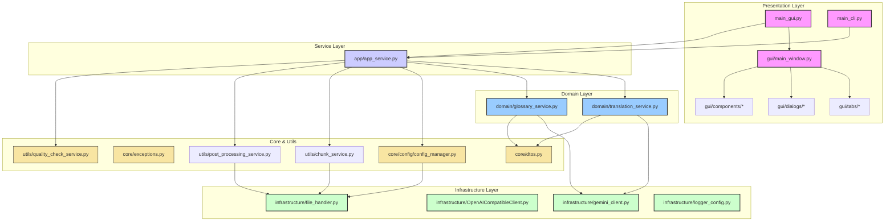

# BTG - Batch Translator for Gemini

BTG는 Google Gemini API를 사용하여 대용량 텍스트를 효율적으로 번역하는 배치 번역 도구입니다. 소설 번역에 특화되어 있으며, 용어집(Glossary) 관리와 병렬 처리를 통한 고성능 번역을 제공합니다.

## 주요 기능

### 🔄 배치 번역
- **병렬 처리**: `ThreadPoolExecutor`를 활용한 멀티스레딩 고속 번역
- **이어하기 기능**: 메타데이터 기반으로 중단된 번역 작업 자동 재개
- **콘텐츠 안전 재시도**: 검열 오류 시 자동 청크 분할 및 재시도
- **진행률 추적**: tqdm 기반 실시간 번역 진행 상황 모니터링
- **프리필 번역**: Gemini API의 프리필(Prefill) 기능을 활용한 고품질 번역

### 📝 용어집(Glossary) 관리
- **자동 추출**: AI를 통한 텍스트에서 외국어 고유명사 자동 추출 및 번역
- **JSON 기반 관리**: 용어집을 JSON 파일로 관리
- **등장 횟수 추적**: 고유명사별 출현 빈도 자동 분석
- **동적 용어집 주입**: 번역 시 자동으로 용어집 컨텍스트 주입
- **용어집 편집기**: GUI 내장 용어집 편집기 제공

### 🔍 품질 검사 및 검토
- **품질 이상 감지**: 선형 회귀 분석을 통한 번역 누락(Omission) 및 환각(Hallucination) 의심 구간 탐지
- **청크별 검토**: 원문과 번역문 비교 검토 기능
- **재번역 기능**: 의심 구간 또는 개별 청크 재번역 지원
- **수동 수정**: GUI에서 직접 번역 결과 편집 가능

### 🎯 콘텐츠 특화 기능
- **무검열 번역**: 전문 프롬프트를 통한 충실한 번역
- **전문 프롬프트 템플릿**: 소설 번역에 최적화된 시스템 프롬프트
- **다국어 지원**: 자동 언어 감지 및 다양한 언어 쌍 지원
- **Thinking Budget**: Gemini의 추론 기능 활용 옵션

### 🖥️ 사용자 친화적 GUI
- **모던 인터페이스**: ttkbootstrap 기반의 현대적인 UI
- **탭 기반 구성**: 설정, 용어집, 로그, 검토 탭으로 기능 분리
- **실시간 로그**: 번역 과정의 상세한 로그 출력 (품질 이슈 및 에러 필터링)
- **설정 관리**: API 키, 모델 선택, 생성 파라미터 등 통합 관리
- **툴팁 지원**: 각 설정 항목에 대한 상세 설명 제공

### 🔌 다중 API 지원
- **Gemini API**: Google Gemini 모델 지원 (gemini-2.5-flash, gemini-3-pro-preview 등)
- **Vertex AI**: GCP 서비스 계정 인증을 통한 Vertex AI 지원
- **OpenAI 호환 API**: OpenAI 호환 엔드포인트 지원 (예정)
- **다중 API 키**: 여러 API 키 자동 순환으로 Rate Limit 대응

## 시스템 아키텍처

BTG는 유지보수성과 확장성을 높이기 위해 다음과 같은 4계층 아키텍처(4-Tier Architecture)를 채택했습니다.



### 계층별 설명

- **Presentation Layer**: 사용자와의 상호작용을 담당합니다.
  - `main_gui.py` / `main_cli.py`: 애플리케이션 진입점
  - `gui/main_window.py`: 메인 윈도우 및 탭 조정
  - `gui/tabs/`: 설정(`settings_tab`), 용어집(`glossary_tab`), 로그(`log_tab`), 검토(`review_tab`) 탭
  - `gui/dialogs/`: 용어집 편집기 등 다이얼로그
  - `gui/components/`: 재사용 가능한 UI 컴포넌트 (로그 핸들러, 스크롤 프레임, 툴팁)

- **Service Layer**: 애플리케이션의 주요 유스케이스를 조정합니다.
  - `app/app_service.py`: 프레젠테이션 계층과 도메인 계층을 연결하는 퍼사드

- **Domain Layer**: 핵심 비즈니스 로직을 포함합니다.
  - `domain/translation_service.py`: 번역 비즈니스 로직 및 용어집 주입
  - `domain/glossary_service.py`: 용어집 추출 및 관리

- **Core & Utils**: 프로젝트 전반에서 사용되는 공통 기능입니다.
  - `core/dtos.py`: 데이터 전송 객체 (TranslationJobProgressDTO, GlossaryEntryDTO 등)
  - `core/exceptions.py`: 계층별 커스텀 예외 클래스
  - `core/config/config_manager.py`: 설정 파일 관리
  - `utils/chunk_service.py`: 텍스트 청킹 서비스
  - `utils/post_processing_service.py`: 번역 후처리 서비스
  - `utils/quality_check_service.py`: 품질 검사 서비스

- **Infrastructure Layer**: 외부 시스템과의 통신 및 하위 레벨 작업을 처리합니다.
  - `infrastructure/gemini_client.py`: Gemini API 클라이언트 (다중 키 순환, 예외 처리)
  - `infrastructure/OpenAICompatibleClient.py`: OpenAI 호환 API 클라이언트
  - `infrastructure/file_handler.py`: 파일 입출력 및 메타데이터 관리
  - `infrastructure/logger_config.py`: 로깅 설정 (concurrent-log-handler 지원)

## 파일 구조

```
BTG/
├── main_gui.py                      # GUI 애플리케이션 실행 파일
├── main_cli.py                      # CLI 애플리케이션 실행 파일
├── config.json                      # 설정 파일
├── requirements.txt                 # Python 의존성
│
├── app/
│   └── app_service.py               # 서비스 계층: 유스케이스 조정
│
├── domain/
│   ├── translation_service.py       # 도메인 계층: 번역 비즈니스 로직
│   └── glossary_service.py          # 도메인 계층: 용어집 추출 및 관리
│
├── infrastructure/
│   ├── gemini_client.py             # 인프라 계층: Gemini API 클라이언트
│   ├── OpenAICompatibleClient.py    # 인프라 계층: OpenAI 호환 API 클라이언트
│   ├── file_handler.py              # 인프라 계층: 파일 입출력 유틸리티
│   └── logger_config.py             # 인프라 계층: 로깅 설정
│
├── core/
│   ├── dtos.py                      # Core: 데이터 전송 객체 (DTOs)
│   ├── exceptions.py                # Core: 커스텀 예외 클래스
│   └── config/
│       └── config_manager.py        # Core: 설정 관리
│
├── gui/
│   ├── main_window.py               # GUI: 메인 윈도우
│   ├── tabs/
│   │   ├── base_tab.py              # 탭 기본 클래스
│   │   ├── settings_tab.py          # 설정 및 번역 탭
│   │   ├── glossary_tab.py          # 용어집 관리 탭
│   │   ├── log_tab.py               # 로그 출력 탭
│   │   └── review_tab.py            # 검토 및 수정 탭
│   ├── dialogs/
│   │   └── glossary_editor.py       # 용어집 편집기 다이얼로그
│   └── components/
│       ├── log_handlers.py          # GUI 로그 핸들러
│       ├── scrollable_frame.py      # 스크롤 가능 프레임
│       └── tooltip.py               # 툴팁 컴포넌트
│
├── utils/
│   ├── chunk_service.py             # Utils: 텍스트 청킹 서비스
│   ├── post_processing_service.py   # Utils: 번역 후처리 서비스
│   └── quality_check_service.py     # Utils: 품질 검사 서비스
│
├── logs/                            # 실행별 로그 디렉토리
├── batch_results/                   # 번역 결과 출력 디렉토리
└── prompt_library/                  # 프롬프트 템플릿 라이브러리
```

## 설치 및 실행

### 요구사항
- Python 3.9+
- Google Gemini API 키

### 설치
```bash
# 의존성 설치
pip install -r requirements.txt
```

### 실행
```bash
# GUI 모드
python main_gui.py

# CLI 모드
python main_cli.py
```

## 특징적인 기능

### 메타데이터 기반 이어하기
- 번역 작업의 진행 상황을 `.meta.json` 파일에 저장
- 중단된 작업을 정확히 이어서 진행 가능
- 설정 변경 감지 및 호환성 확인 (config hash)

### 후처리 기능
- 번역 헤더 자동 제거
- 마크다운 블록 정리
- HTML 구조 검증
- 청크 인덱스 마커 제거

### 품질 검사 (QualityCheckService)
- 선형 회귀 분석으로 원문/번역문 길이 비율 분석
- 표준편차 기반 이상치 탐지
- 번역 누락(짧은 번역) 및 환각(긴 번역) 의심 구간 자동 식별

### 오류 처리 및 복구
- API 사용량 제한 시 자동 대기 및 재시도
- 여러 API 키 간 자동 순환 (GeminiClient)
- 콘텐츠 안전 필터링 발생 시 청크 자동 분할 재시도
- 계층별 예외 클래스로 세분화된 에러 핸들링

## 로그 및 모니터링

- **실시간 진행률**: tqdm 기반 청크별 번역 진행 상황
- **성공률 통계**: 번역 성공/실패 비율 실시간 표시
- **상세 로그**: API 호출, 오류, 성능 메트릭
- **시각적 진행 표시**: 진행률 바 및 상태 메시지
- **품질 이슈 하이라이트**: 품질 의심 구간 자동 표시 (⚠️ 마크)
- **격리된 실행 로그**: 각 실행 인스턴스는 `logs/run_<timestamp>_<pid>/btg_app.log`에 기록되어 파일 충돌을 방지하며, `concurrent-log-handler`를 통해 멀티프로세스 환경에서도 안전하게 롤오버됩니다.

## 의존성

```
tqdm>=4.65.0
python-dotenv>=0.21.0
google-genai
ttkbootstrap>=1.10.1
concurrent-log-handler>=0.9.25
google-api-core
```

## 라이선스

이 프로젝트는 MIT 라이선스를 따릅니다.

**MIT License**

Copyright (c) 2025 Hyunwoo_Room

Permission is hereby granted, free of charge, to any person obtaining a copy
of this software and associated documentation files (the "Software"), to deal
in the Software without restriction, including without limitation the rights
to use, copy, modify, merge, publish, distribute, sublicense, and/or sell
copies of the Software, and to permit persons to whom the Software is
furnished to do so, subject to the following conditions:

The above copyright notice and this permission notice shall be included in all
copies or substantial portions of the Software.

THE SOFTWARE IS PROVIDED "AS IS", WITHOUT WARRANTY OF ANY KIND, EXPRESS OR
IMPLIED, INCLUDING BUT NOT LIMITED TO THE WARRANTIES OF MERCHANTABILITY,
FITNESS FOR A PARTICULAR PURPOSE AND NONINFRINGEMENT. IN NO EVENT SHALL THE
AUTHORS OR COPYRIGHT HOLDERS BE LIABLE FOR ANY CLAIM, DAMAGES OR OTHER
LIABILITY, WHETHER IN AN ACTION OF CONTRACT, TORT OR OTHERWISE, ARISING FROM,
OUT OF OR IN CONNECTION WITH THE SOFTWARE OR THE USE OR OTHER DEALINGS IN THE
SOFTWARE.

## 주의사항

- API 사용량에 따른 비용이 발생할 수 있습니다
- 대용량 파일 번역 시 충분한 디스크 공간을 확보하세요
- 콘텐츠 번역 시 관련 법규를 준수하세요

