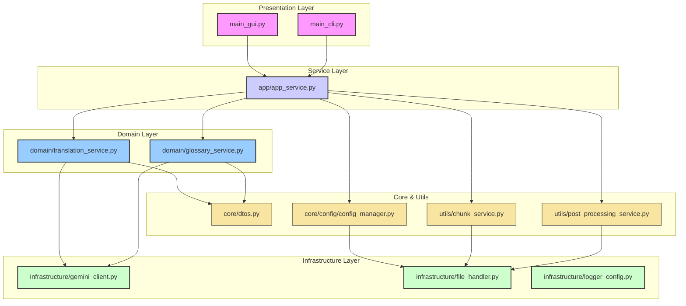

# BTG - Batch Translator for Gemini

BTG는 Google Gemini API를 사용하여 대용량 텍스트를 효율적으로 번역하는 배치 번역 도구입니다. 특정 소설 번역에 특화되어 있으며, 고유명사 관리와 병렬 처리를 통한 고성능 번역을 제공합니다.

## 주요 기능

### 🔄 배치 번역
- **병렬 처리**: 멀티스레딩을 통한 고속 번역 처리[3]
- **이어하기 기능**: 메타데이터 기반으로 중단된 번역 작업 재개[3]
- **콘텐츠 안전 재시도**: 검열 오류 시 자동 청크 분할 및 재시도[3]
- **진행률 추적**: 실시간 번역 진행 상황 모니터링[3][4]

### 📝 고유명사 관리
- **자동 추출**: 텍스트에서 외국어 고유명사 자동 추출 및 한국어 번역[1]
- **CSV 관리**: 고유명사-번역 매핑을 CSV 파일로 관리[1][2]
- **등장 횟수 추적**: 고유명사별 출현 빈도 분석[1]

### 🎯 특정 콘텐츠 특화
- **무검열 번역**:특정 콘텐츠를 검열 없이 자연스럽게 번역[6]
- **전문 프롬프트**: 특정 소설 번역에 최적화된 프롬프트 템플릿[6]
- **콘텐츠 필터링 우회**: 안전 필터 우회 메커니즘 내장[3]

### 🖥️ 사용자 친화적 GUI
- **직관적 인터페이스**: Tkinter 기반의 사용하기 쉬운 GUI[4]
- **설정 관리**: API 키, 모델 선택, 생성 파라미터 등 통합 관리[4]
- **실시간 로그**: 번역 과정의 상세한 로그 출력[4]

## 시스템 아키텍처

BTG는 유지보수성과 확장성을 높이기 위해 다음과 같은 4계층 아키텍처(4-Tier Architecture)를 채택했습니다.



- **Presentation Layer**: 사용자와의 상호작용을 담당합니다. GUI(`main_gui.py`)와 CLI(`main_cli.py`)가 이 계층에 속합니다.
- **Service Layer**: 애플리케이션의 주요 유스케이스를 조정합니다. `app_service.py`가 프레젠테이션 계층과 도메인 계층을 연결하는 인터페이스 역할을 합니다.
- **Domain Layer**: 핵심 비즈니스 로직을 포함합니다. 번역(`translation_service.py`) 및 용어집 관리(`glossary_service.py`)와 같은 도메인별 규칙이 여기에 구현됩니다.
- **Core & Utils**: DTOs, 설정 관리, 텍스트 청킹, 후처리 등 프로젝트 전반에서 사용되는 공통 기능 및 유틸리티를 제공합니다.
- **Infrastructure Layer**: 외부 시스템과의 통신 및 하위 레벨 작업을 처리합니다. Gemini API 클라이언트(`gemini_client.py`), 파일 입출력(`file_handler.py`), 로깅(`logger_config.py`) 등이 포함됩니다.

## 파일 구조

```
BTG/
├── main_gui.py                  # GUI 애플리케이션 실행 파일
├── main_cli.py                  # CLI 애플리케이션 실행 파일
├── app/
│   └── app_service.py           # 서비스 계층: 유스케이스 조정
├── domain/
│   ├── translation_service.py   # 도메인 계층: 번역 비즈니스 로직
│   └── glossary_service.py      # 도메인 계층: 용어집 추출 및 관리
├── infrastructure/
│   ├── gemini_client.py         # 인프라 계층: Gemini API 클라이언트
│   ├── file_handler.py          # 인프라 계층: 파일 입출력 유틸리티
│   └── logger_config.py         # 인프라 계층: 로깅 설정
├── core/
│   ├── dtos.py                  # Core: 데이터 전송 객체 (DTOs)
│   ├── exceptions.py            # Core: 커스텀 예외
│   └── config/
│       └── config_manager.py    # Core: 설정 관리
├── utils/
│   ├── chunk_service.py         # Utils: 텍스트 청킹 서비스
│   └── post_processing_service.py # Utils: 번역 후처리 서비스
└── config.json                  # 설정 파일
```

## 특징적인 기능

### 메타데이터 기반 이어하기[2][3]
- 번역 작업의 진행 상황을 메타데이터 파일에 저장
- 중단된 작업을 정확히 이어서 진행 가능
- 설정 변경 감지 및 호환성 확인

### 후처리 기능[3]
- 번역 헤더 제거
- 마크다운 블록 정리
- HTML 구조 검증
- 청크 인덱스 마커 제거

### 오류 처리 및 복구[7]
- API 사용량 제한 시 자동 대기 및 재시도
- 여러 API 키 간 자동 순환
- 콘텐츠 안전 필터링 우회 메커니즘

## 로그 및 모니터링

- **실시간 진행률**: 청크별 번역 진행 상황
- **성공률 통계**: 번역 성공/실패 비율
- **상세 로그**: API 호출, 오류, 성능 메트릭
- **시각적 진행 표시**: 진행률 바 및 상태 메시지

## 라이선스

이 프로젝트는 MIT 라이선스를 따릅니다.

**MIT License**

Copyright (c) 2025 Hyunwoo_Room

Permission is hereby granted, free of charge, to any person obtaining a copy
of this software and associated documentation files (the "Software"), to deal
in the Software without restriction, including without limitation the rights
to use, copy, modify, merge, publish, distribute, sublicense, and/or sell
copies of the Software, and to permit persons to whom the Software is
furnished to do so, subject to the following conditions:

The above copyright notice and this permission notice shall be included in all
copies or substantial portions of the Software.

THE SOFTWARE IS PROVIDED "AS IS", WITHOUT WARRANTY OF ANY KIND, EXPRESS OR
IMPLIED, INCLUDING BUT NOT LIMITED TO THE WARRANTIES OF MERCHANTABILITY,
FITNESS FOR A PARTICULAR PURPOSE AND NONINFRINGEMENT. IN NO EVENT SHALL THE
AUTHORS OR COPYRIGHT HOLDERS BE LIABLE FOR ANY CLAIM, DAMAGES OR OTHER
LIABILITY, WHETHER IN AN ACTION OF CONTRACT, TORT OR OTHERWISE, ARISING FROM,
OUT OF OR IN CONNECTION WITH THE SOFTWARE OR THE USE OR OTHER DEALINGS IN THE
SOFTWARE.

## 주의사항

- API 사용량에 따른 비용이 발생할 수 있습니다
- 대용량 파일 번역 시 충분한 디스크 공간을 확보하세요
- 성인 콘텐츠 번역 시 관련 법규를 준수하세요

