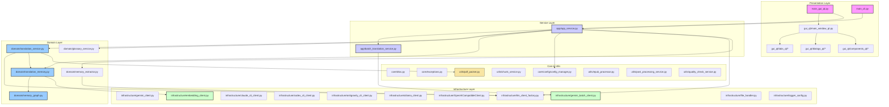

# BTG - Batch Translator for Gemini & Multi-LLM

BTG는 대용량 텍스트 및 웹소설/문학 번역에 특화된 고성능 배치 번역 플랫폼입니다.  
Google Gemini API를 비롯해 로컬 CLI 구독 세션(Claude Code, OpenAI Codex, Google Antigravity), 로컬 LLM(Ollama), OpenAI 호환 엔드포인트를 폭넓게 지원하며, **Gemini Batch API(비용 50% 절감)**, **PageFold PDF 토큰 압축(최대 90% 절감)**, **Voyage AI & WygLore Leaf 기반 번역 장기기억 및 연상 기억 그래프** 등 최신 기술을 탑재하여 압도적인 비용 효율과 번역 일관성을 제공합니다.

---

## 🌟 핵심 하이라이트

- **🔄 Gemini Batch API 지원**: 표준 API 대비 50% 할인된 요금으로 대규모 비동기 번역 수행, 중단 복구 및 "실시간으로 마무리" 연계
- **📦 PageFold PDF 토큰 압축 엔진**: 순수 파이썬(Zero-Dependency) 초경량 PDF 1.7 엔진을 통해 대규모 용어집·설정집 프롬프트 토큰을 최대 90% 이상 절감
- **🧠 번역 장기기억 (Translation Memory) & WygLore Leaf 연상 그래프**:
  - Voyage AI 임베딩(`voyage-4-lite`)으로 사전 1회 인덱싱(추가 번역 지연 및 API 비용 0)
  - WygLore Leaf 방식 연상 기억 그래프(점화, 확산, 헵 강화, 호박 감쇠, 시간 서술어)
  - 비동기 백그라운드 인물 메모 자동 추출(말투, 호칭, 1인칭, 관계)
  - 무결성 번역 모드(Integrity Mode)와 완벽 연동(줄 번호 기반 매핑)
- **🔌 로컬 무과금 CLI 런타임 & 멀티 프로바이더**:
  - 로컬 구독 세션(Claude Code, Codex CLI, Antigravity CLI)을 서브프로세스로 활용해 API 과금 없이 $0 번역
  - Ollama 네이티브 API 지원 (`num_ctx` 자동 제어, `<think>` 블록 제거, Pydantic 스키마 검증)
  - 다중 Gemini API 키 자동 순환 및 서킷 브레이커
- **🖥️ 모던 PySide6 GUI**: 반응형 다크 테마, 동적 프로바이더 설정 폼, 배치 작업 관리 패널, "기억뜰 보기" 시각화 다이얼로그

---

## 🚀 주요 기능

### 1. 다양한 번역 모드
- **실시간 병렬 번역 (Standard Mode)**: `ThreadPoolExecutor`를 통한 고속 멀티스레딩 번역 및 프리필(Prefill) 지원
- **Gemini Batch API 모드 (Batch Mode)**:
  - Google Gemini Batch API를 활용한 비동기 배치 번역 (50% 비용 절감)
  - 청크별 인라인 요청을 18MB 이하 단위로 묶어 자동 분할 제출
  - PageFold 용어집 PDF를 1회 업로드 후 재참조하여 전송 용량 및 토큰 최적화
  - 메타데이터 기반 상태 추적 및 60초 주기 자동 폴링, 안전한 이어하기
  - **배치 전용 유료 API 키 (`batch_api_key`) 지원**: 무료 티어 키 사용 불가 제약에 대응하여 로테이션용 무료 키와 분리 지정 가능
  - 미완료/실패/검열 청크는 **"실시간으로 마무리"**를 통해 표준 모드 이어하기 및 검열 자동 분할 재시도로 즉시 전환
- **무결성 번역 모드 (Integrity Mode)**:
  - JSON 구조화 출력을 통해 문단/줄 단위 번역 무결성을 100% 보장 (누락 및 환각 원천 차단)
  - 번역 장기기억과 완벽 결합되어 줄 번호 기반의 정밀한 문단 짝짓기 및 임시 결과 복구 지원
- **EPUB 전자책 번역**:
  - XHTML 챕터 구조와 마크업 스타일을 보존하면서 고품질 번역 수행
  - 과부하(503) 시 챕터 전체 롤백 없이 성공할 때까지 안전하게 청크 재시도

### 2. PageFold PDF 텍스트 토큰 압축 엔진
- **순수 파이썬 구현 (`utils/pdf_packer.py`)**:
  - 표준 라이브러리(`zlib`, `struct`)만으로 구동되는 Zero-Dependency 초경량 PDF 1.7 생성기
  - 다국어(한글, 한자, CJK 확장, 결합 분음 기호, 이모지) Adobe `/ToUnicode` CMap 완벽 지원
- **토큰 절감 극대화**:
  - 1~2pt 초소형 폰트로 방대한 용어집·인물설정·세계관 텍스트를 단일 PDF 페이지로 패킹
  - Gemini의 PDF 고정 과금(~280 토큰/페이지)과 무료 텍스트 스트림 추출 특성을 활용해 프롬프트 토큰 최대 90% 이상 절감
- **유연한 모드 지원**:
  - **Reference 모드 (기본 권장)**: 번역 본문은 텍스트로 유지하여 번역 충실도를 보존하고, 매 청크마다 반복 투입되는 용어집만 PDF Part로 첨부
  - **Marked Tags 모드**: 프롬프트 내 `<pdf>...</pdf>`로 감싼 배경 설명/지침 영역만 선택적으로 PDF 압축
  - **Chunk 모드**: 본문 청크 전체를 PDF화 (실험적 옵션)
- **개행 보존 및 비-Gemini 격리**:
  - 개행 소실 방지 디렉티브 및 복원기(`restore_response_newlines`) 탑재
  - 용어집 PDF 첨부 시 모델 혼동을 방지하는 안내문(`PAGEFOLD_GLOSSARY_NOTICE`) 자동 주입
  - PageFold를 지원하지 않는 비-Gemini 프로바이더 호출 시 자동으로 PDF 변환을 건너뛰고 텍스트로 치환

### 3. 번역 장기기억 & WygLore Leaf 연상 기억 그래프
- **Voyage AI 임베딩 (`voyage-4-lite`, 512차원)**:
  - 소설 원문 문단과 용어집을 번역 시작 전 1회 사전 인덱싱하여 `<파일명>_memory/`에 로컬 캐싱
  - 번역 도중에는 추가 임베딩 API 호출이 전혀 발생하지 않아 **번역 속도 지연 0, 추가 API 비용 0**
  - 청크 번역 시 현재 청크와 의미적으로 가장 유사한 기 번역 문단 쌍과 관련 용어를 프롬프트(`{{translation_memory}}`)에 자동 주입
  - 키워드 매칭으로 잡히지 않는 별칭, 이명, 오탈자, 변형 표기도 의미 기반 용어 검색으로 포착
- **WygLore Leaf 방식 연상 기억 그래프 (`domain/memory_graph.py`)**:
  - RisuAI 플러그인 WygLore Leaf의 연상 기억 아키텍처를 번역에 최적화하여 이식
  - **3대 가지 체계**: 캐논(용어집, 고정 불변), 인물(자동 추출 성장 가지), 에피소드(번역된 문단)
  - **점화(Activation)**: 인물 이름/별칭 직접 호명 시 강도 1.0, 에피소드는 임베딩 유사도로 씨앗 점화
  - **확산(Spreading)**: 깊이 프리셋(Fast 0홉, Balanced 1홉, Deep 2홉)에 따라 연결된 이웃 가지로 전파
  - **헵 강화(Hebbian Learning)**: 같은 청크에 함께 등장하거나 주입된 가지 간의 연결 가중치 자동 강화 (+0.1)
  - **호박(Amber 감쇠)**: 30청크 이상 점화되지 않은 인물 가지는 호박 속으로 가라앉아 불필요한 프롬프트 오염 방지 (직접 호명 또는 Deep 확산 시 부활)
  - **시간 서술어**: 청크 간 거리를 서사적 시간 표현("바로 앞", "12청크 전", "오래 전 · 호박 속")으로 변환 주입
- **비동기 백그라운드 인물 메모 자동 추출 (`domain/memory_extractor.py`)**:
  - 번역이 완료된 청크에서 인물 말투, 호칭, 1인칭, 관계 메모를 가벼운 보조 모델로 비동기 추출 (메인 번역 속도 영향 없음)
  - 별칭 자동 흡수 및 머지 기록, 이름이 처음 등장한 원문 닻(Evidence) 보관
- **GUI "기억뜰 보기"**:
  - 축적된 인물 가지, 호박 상태, 원문 닻, 흡수 이력을 시각적으로 확인하는 전용 다이얼로그 제공

### 4. 멀티 LLM 프로바이더 & 로컬 무과금 런타임
- **공통 인터페이스 (`BaseLLMClient`) 및 동적 팩토리 (`LLMClientFactory`)**:
  - 프로바이더 설정에 따라 런타임에 적합한 클라이언트를 동적 생성 및 주입
  - UI에서 원클릭으로 각 프로바이더의 연결 상태와 세션을 확인하는 **[인증 / 연결 테스트]** 기능
- **지원 공급자**:
  - **Google Gemini API**: 최신 Gemini 모델 지원 (gemini-2.5-flash, gemini-3-pro-preview 등), Thinking Budget / Dynamic Thinking, 다중 키 등록 순서 기반 최적화 및 쿨다운 관리
  - **로컬 CLI 런타임 (Claude Code, OpenAI Codex, Google Antigravity `agy`)**:
    - 별도 API 키 없이 사용자가 이미 구독 중인 세션(Claude Pro/Max, ChatGPT Plus, Google Auth)을 서브프로세스로 활용해 **추가 API 비용 $0** 번역
    - Windows 명령줄 길이 상한(8,191자)을 회피하기 위해 `stdin` 파이프 스트리밍 방식 적용
    - 로컬 캐시 파싱을 통한 실시간 가용 모델 동적 목록화
  - **Ollama 네이티브 API (`/api/chat`)**:
    - 로컬 GPU의 오픈 소스 모델(Qwen, DeepSeek, Llama 등) 활용
    - `options.num_ctx`(기본 16,384) 자동 전달로 대용량 번역 프롬프트 앞부분 잘림 현상 방지
    - 추론 모델의 `<think>...</think>` 블록 자동 제거
    - Pydantic 스키마 검증 기반 구조화 출력 지원 (무결성 모드, 용어집 추출 호환)
  - **Vertex AI & OpenAI 호환 API**:
    - GCP 서비스 계정 기반 Vertex AI 엔드포인트 지원
    - 다양한 서드파티 OpenAI 호환 API 연동

### 5. 용어집(Glossary) 관리
- **AI 고유명사 자동 추출**: 원문에서 인명, 지명, 기술명, 단체명을 자동 추출 및 번역
- **동적 용어집 주입**: 청크 본문에 등장하는 용어를 감지해 프롬프트에 자동 주입
- **의미 기반 용어 검색**: Voyage 임베딩을 통해 키워드가 완전 일치하지 않는 유사 용어도 검색 주입
- **용어집 편집기**: GUI 내장 용어집 편집기를 통한 수기 수정, 출현 빈도 확인, JSON 가져오기/내보내기

### 6. 품질 검사 및 복구 시스템
- **통계적 품질 검사 (`QualityCheckService`)**:
  - 선형 회귀 분석으로 원문 대비 번역문 길이 비율을 분석해 누락(Omission, ⚠️ 짧음) 및 환각(Hallucination, ⚠️ 김) 구간 자동 탐지
- **청크별 비교 검토 및 재번역**: GUI 검토 탭에서 원문/번역문을 대조하고 개별 청크 재번역 또는 직접 수정 가능
- **콘텐츠 안전 필터링 자동 대응**: API 검열 오류 발생 시 청크를 자동으로 분할하여 재시도
- **지능형 장애 복구**: 과부하(503) 및 할당량 초과(429) 시 지수 백오프 및 서킷 브레이커 작동

---

## 🏗️ 시스템 아키텍처

BTG는 명확한 관심사 분리를 위해 4계층 아키텍처(4-Tier Architecture)를 채택하고 있습니다.


```mermaid
graph TD
    subgraph Presentation Layer
        A[main_gui_qt.py]
        B[main_cli.py]
        C[gui_qt/main_window_qt.py]
        D[gui_qt/tabs_qt/*]
        E[gui_qt/dialogs_qt/*]
        F[gui_qt/components_qt/*]
    end

    subgraph Service Layer
        G[app/app_service.py]
        G2[app/batch_translation_service.py]
    end

    subgraph Domain Layer
        H[domain/translation_service.py]
        I[domain/glossary_service.py]
        M1[domain/translation_memory.py]
        M2[domain/memory_graph.py]
        M3[domain/memory_extractor.py]
    end

    subgraph Core & Utils
        J[core/dtos.py]
        K[core/exceptions.py]
        L[core/config/config_manager.py]
        U1[utils/chunk_service.py]
        U2[utils/pdf_packer.py]
        U3[utils/epub_processor.py]
        U4[utils/post_processing_service.py]
        U5[utils/quality_check_service.py]
    end

    subgraph Infrastructure Layer
        P1[infrastructure/gemini_client.py]
        P2[infrastructure/gemini_batch_client.py]
        P3[infrastructure/claude_cli_client.py]
        P4[infrastructure/codex_cli_client.py]
        P5[infrastructure/antigravity_cli_client.py]
        P6[infrastructure/ollama_client.py]
        P7[infrastructure/OpenAICompatibleClient.py]
        P8[infrastructure/embedding_client.py]
        P9[infrastructure/llm_client_factory.py]
        R[infrastructure/file_handler.py]
        S[infrastructure/logger_config.py]
    end

    A --> C
    C --> D
    C --> E
    C --> F
    A --> G
    B --> G
    G --> G2
    G --> H
    G --> I
    G --> M1
    G --> L
    G --> P9
    G2 --> P2
    H --> P9
    H --> M1
    H --> U2
    M1 --> M2
    M1 --> P8
    G --> M3
    M3 --> P9

    style A fill:#f9f,stroke:#333,stroke-width:2px
    style B fill:#f9f,stroke:#333,stroke-width:2px
    style G fill:#ccf,stroke:#333,stroke-width:2px
    style G2 fill:#ccf,stroke:#333,stroke-width:2px
    style H fill:#9cf,stroke:#333,stroke-width:2px
    style M1 fill:#9cf,stroke:#333,stroke-width:2px
    style M2 fill:#9cf,stroke:#333,stroke-width:2px
    style U2 fill:#f8e5a2,stroke:#333,stroke-width:1px
    style P2 fill:#cfc,stroke:#333,stroke-width:2px
    style P8 fill:#cfc,stroke:#333,stroke-width:2px
```

### 계층별 세부 구조

- **Presentation Layer**: 사용자 인터페이스 및 상호작용
  - `main_gui_qt.py`: PySide6 기반 모던 GUI 애플리케이션 진입점
  - `main_cli.py`: 배치/실시간/장기기억 옵션을 제공하는 CLI 진입점
  - `gui_qt/tabs_qt/`: 설정(`settings_tab_qt`), 용어집(`glossary_tab_qt`), 로그(`log_tab_qt`), 검토(`review_tab_qt`), 활동(`activity_tab_qt`) 탭
  - `gui_qt/dialogs_qt/`: 용어집 편집기, 프리필 히스토리 편집기, 기억뜰 보기 다이얼로그
- **Service Layer**: 유스케이스 조정 퍼사드
  - `app/app_service.py`: 번역, 용어집, 설정, 장기기억 인덱싱, 헬스체크 라이프사이클 총괄 퍼사드
  - `app/batch_translation_service.py`: Gemini Batch API 작업 분할 제출, 조회, 수거 및 결과 병합 전담
- **Domain Layer**: 핵심 번역 비즈니스 로직
  - `domain/translation_service.py`: 번역 요청 조립, 동적 용어집 주입, PageFold PDF 주입, 무결성 번역 분할
  - `domain/glossary_service.py`: 고유명사 용어집 추출 및 빈도 관리
  - `domain/translation_memory.py`: Voyage 임베딩 기반 문단/용어 벡터 저장소 및 검색
  - `domain/memory_graph.py`: WygLore Leaf 연상 기억 그래프 (점화, 확산, 헵 강화, 호박 감쇠)
  - `domain/memory_extractor.py`: 번역 청크 기반 백그라운드 인물 메모 자동 추출
- **Infrastructure Layer**: 외부 LLM API, 로컬 CLI 및 시스템 입출력
  - `infrastructure/llm_client_factory.py`: 설정에 따른 멀티 프로바이더 클라이언트 동적 팩토리
  - `infrastructure/gemini_client.py` & `gemini_batch_client.py`: Gemini API 및 Gemini Batch API 클라이언트
  - `infrastructure/claude_cli_client.py`, `codex_cli_client.py`, `antigravity_cli_client.py`: 로컬 무과금 CLI 어댑터
  - `infrastructure/ollama_client.py`: 로컬 Ollama REST API 클라이언트
  - `infrastructure/embedding_client.py`: Voyage AI 임베딩 REST 클라이언트
  - `infrastructure/key_pool.py`, `circuit_breaker.py`, `request_scheduler.py`: 키 회전 및 장애 내구도 제어
- **Core & Utils**: 전역 공유 DTO, 설정 및 보조 유틸리티
  - `utils/pdf_packer.py`: Zero-Dependency 순수 파이썬 PDF 1.7 압축 엔진
  - `utils/chunk_service.py` & `epub_processor.py`: 텍스트 및 전자책 청킹 서비스
  - `utils/quality_check_service.py` & `post_processing_service.py`: 번역 품질 분석 및 후처리

---

## 📁 디렉토리 구조

```
BTG/
├── main_gui_qt.py                   # PySide6 모던 GUI 실행 파일
├── main_cli.py                      # CLI 실행 파일
├── config.json                      # 애플리케이션 설정 파일
├── requirements.txt                 # Python 의존성 목록
│
├── app/
│   ├── app_service.py               # 서비스 계층: 메인 애플리케이션 퍼사드
│   └── batch_translation_service.py # 서비스 계층: Gemini Batch API 관리 서비스
│
├── domain/
│   ├── translation_service.py       # 도메인 계층: 번역 비즈니스 로직 및 요청 조립
│   ├── glossary_service.py          # 도메인 계층: 용어집 추출 및 관리
│   ├── translation_memory.py        # 도메인 계층: 번역 장기기억 저장소
│   ├── memory_graph.py              # 도메인 계층: WygLore Leaf 연상 기억 그래프
│   └── memory_extractor.py          # 도메인 계층: 인물 메모 비동기 추출기
│
├── infrastructure/
│   ├── base_client.py               # 인프라 계층: LLM 클라이언트 추상 인터페이스
│   ├── llm_client_factory.py        # 인프라 계층: 동적 클라이언트 팩토리
│   ├── gemini_client.py             # 인프라 계층: Gemini 실시간 API 클라이언트
│   ├── gemini_batch_client.py       # 인프라 계층: Gemini Batch API 클라이언트
│   ├── claude_cli_client.py         # 인프라 계층: Claude Code CLI 어댑터
│   ├── codex_cli_client.py          # 인프라 계층: OpenAI Codex CLI 어댑터
│   ├── antigravity_cli_client.py    # 인프라 계층: Google Antigravity CLI 어댑터
│   ├── ollama_client.py             # 인프라 계층: Ollama 네이티브 API 클라이언트
│   ├── OpenAICompatibleClient.py    # 인프라 계층: OpenAI 호환 API 클라이언트
│   ├── embedding_client.py          # 인프라 계층: Voyage AI 임베딩 클라이언트
│   ├── file_handler.py              # 인프라 계층: 파일 I/O 및 메타데이터 관리
│   ├── key_pool.py                  # 인프라 계층: 다중 API 키 풀 관리
│   ├── circuit_breaker.py           # 인프라 계층: 서킷 브레이커
│   └── logger_config.py             # 인프라 계층: concurrent-log-handler 기반 로깅
│
├── gui_qt/
│   ├── main_window_qt.py            # GUI: 메인 윈도우 및 비동기 루프 연동
│   ├── styles.qss                   # GUI: 반응형 QSS 다크 스타일시트
│   ├── tabs_qt/                     # GUI: 설정, 용어집, 로그, 검토, 활동 탭
│   ├── dialogs_qt/                  # GUI: 용어집 편집기, 기억뜰 보기 등 다이얼로그
│   └── components_qt/               # GUI: 모드 카드, 툴팁, 배지 컴포넌트
│
├── core/
│   ├── dtos.py                      # Core: 전송 객체 (Progress, Batch, Memory DTO)
│   ├── exceptions.py                # Core: 계층별 커스텀 예외 클래스
│   └── config/config_manager.py     # Core: 설정 직렬화 및 스키마 관리
│
├── utils/
│   ├── pdf_packer.py                # Utils: PageFold 순수 파이썬 PDF 1.7 압축기
│   ├── chunk_service.py             # Utils: 텍스트 청킹 서비스
│   ├── epub_processor.py            # Utils: EPUB 파싱 및 패키징
│   ├── post_processing_service.py   # Utils: 마크다운/HTML 번역 후처리
│   └── quality_check_service.py     # Utils: 선형 회귀 품질 분석기
│
├── docs/worklog/                    # 프로젝트 작업 기록 (WORKLOG)
├── logs/                            # 실행별 격리 로그 디렉토리
└── prompt_library/                  # 소설 번역에 최적화된 프롬프트 템플릿
```

---

## 💻 설치 및 실행

### 1. 요구사항
- Python 3.10+
- 지원 프로바이더 중 하나 이상의 API 키 또는 로컬 세션:
  - Google Gemini API 키 (유료 또는 무료)
  - Claude Code CLI, Codex CLI 또는 Antigravity CLI 로컬 세션
  - 로컬 Ollama 인스턴스
  - Voyage AI API 키 (번역 장기기억 사용 시 선택 사항)

### 2. 설치
```bash
# 가상환경 생성 및 활성화
python -m venv myenv
source myenv/bin/activate  # Windows: .\myenv\Scripts\activate

# 필수 의존성 설치
pip install -r requirements.txt
```

### 3. 실행 방법

#### GUI 실행 (권장)
```bash
python main_gui_qt.py
```

#### CLI 실행
기본 실시간 번역:
```bash
python main_cli.py input.txt -o output.txt --api-keys "KEY1,KEY2"
```

Gemini Batch API 번역 (50% 비용 절감):
```bash
# 1. 배치 작업 제출
python main_cli.py input.txt --batch-submit

# 2. 배치 상태 확인 및 수거 (예약 작업/cron 연동 가능)
python main_cli.py input.txt --batch-status

# 3. 미완료 청크 실시간 마무리
python main_cli.py input.txt --batch-finish realtime
```

번역 장기기억 (Voyage 임베딩) 활성화:
```bash
python main_cli.py input.txt -o output.txt --translation-memory --voyage-api-key "pa-..."
```

---

## 📖 주요 기능 상세 가이드

### 1. Gemini Batch API 배치 번역 모드
- **작동 원리**: 대용량 텍스트를 청크 분할한 뒤, 최대 18MB 단위의 인라인 요청으로 묶어 Gemini Batch API에 한 번에 제출합니다. 작업은 Google 서버에서 비동기로 처리되며 비용이 50% 할인됩니다.
- **배치 전용 유료 키 (`batch_api_key`)**:
  - Gemini Batch API는 무료 티어 API 키로는 사용할 수 없습니다.
  - 설정 탭의 배치 작업 패널에서 **"배치용 API 키 (유료)"**를 입력해 두면, 일반 번역에 무료 키 풀을 순환 사용하더라도 배치 제출 및 조회는 지정된 유료 키로 안전하게 수행됩니다.
- **실시간으로 마무리**:
  - 검열이나 일시적 오류로 배치에서 완료되지 못한 청크가 있다면, [실시간으로 마무리] 버튼을 눌러 표준 모드 이어하기와 검열 자동 분할 재시도로 즉시 번역을 완성할 수 있습니다.

### 2. 로컬 CLI 무과금 런타임 (Claude, Codex, Antigravity)
- **비용 $0 번역**: 종량제 API 키를 발급받지 않고도 로컬 PC에 로그인된 세션을 그대로 활용합니다.
  - **Claude Code CLI**: `claude` (Claude Pro/Max 세션)
  - **OpenAI Codex CLI**: `codex` (ChatGPT Plus 세션)
  - **Google Antigravity CLI**: `agy` (Google 계정 세션)
- **긴 프롬프트 안전 처리**: Windows 환경의 8,191자 명령줄 길이 제한을 극복하기 위해 모든 프롬프트를 서브프로세스의 `stdin` 스트림으로 안전하게 전송합니다.
- **연결 확인**: 설정 탭에서 프로바이더 선택 후 **[인증 / 연결 테스트]** 버튼을 누르면 CLI 세션 유효성을 즉시 검증합니다.

### 3. Ollama 로컬 LLM 서버
- **컨텍스트 자동 확장**: 기본 2K~4K 컨텍스트에서 번역 프롬프트 앞부분이 잘리는 문제를 방지하기 위해 `num_ctx`를 16,384(설정 가능)로 자동 전달합니다.
- **추론 모델 호환**: Qwen, DeepSeek-R1 등 추론 특화 모델의 `<think>...</think>` 블록을 자동 제거하여 순수 번역문만 정제 추출합니다.
- **구조화 출력**: Pydantic 모델을 JSON Schema로 자동 변환하여 무결성 번역 모드 및 용어집 추출을 지원합니다.

### 4. PageFold PDF 토큰 압축 엔진
- **용어집 토큰 최대 90% 절감**: 수만 자의 용어집 및 배경 설정을 1~2pt 초소형 폰트의 단일 PDF 페이지로 패킹하여 Gemini 프롬프트에 주입합니다.
- **품질 유지**: 본문 청크는 일반 텍스트로 유지하는 Reference 모드를 기본 채택하여 모델이 요약/축약 모드로 전환되는 부작용 없이 원문 충실도를 100% 보존합니다.

### 5. Voyage AI & WygLore Leaf 번역 장기기억
- **사전 1회 인덱싱**: 번역 시작 전 한 번만 Voyage API(`voyage-4-lite`)로 원문 문단을 임베딩하여 로컬에 캐시합니다. 번역 진행 중에는 API를 부르지 않으므로 번역 속도가 전혀 느려지지 않습니다.
- **WygLore Leaf 연상 그래프**:
  - 인물이 직접 호명되면 즉시 점화(1.0)되고, 헵 강화 규칙에 따라 자주 함께 등장한 인물/용어가 연상되어 프롬프트에 떠오릅니다.
  - 오래 등장하지 않은 인물은 호박(Amber) 속으로 가라앉아 프롬프트 공간을 낭비하지 않습니다.
  - "바로 앞", "12청크 전", "오래 전 · 호박 속" 등 시간 서술어가 함께 주입되어 장편 서사의 시간적 연속성을 모델이 인지합니다.
- **인물 메모 자동 추출**: 번역이 끝난 청크에서 백그라운드로 인물 말투, 호칭, 1인칭, 인간관계를 추출해 기억뜰에 기록합니다.

---

## 🛠️ CLI 옵션 레퍼런스

```
usage: main_cli.py [-h] [-o OUTPUT_FILE] [-c CONFIG]
                   [--api-keys API_KEYS] [--use-vertex-ai]
                   [--seed-glossary-file SEED_GLOSSARY_FILE]
                   [--extract_glossary_only] [--resume | --force-new]
                   [--novel-language NOVEL_LANGUAGE]
                   [--enable-dynamic-glossary-injection]
                   [--batch-submit | --batch-status | --batch-finish {realtime,resubmit,keep}]
                   [--translation-memory] [--voyage-api-key VOYAGE_API_KEY]
                   [--rpm RPM]
                   input_files [input_files ...]
```

| 옵션 | 설명 |
| --- | --- |
| `-o, --output_file` | 번역 결과를 저장할 출력 파일 경로 |
| `-c, --config` | 설정 파일 경로 (기본값: `config.json`) |
| `--api-keys` | 쉼표로 구분된 Gemini API 키 목록 |
| `--resume` | 이전 번역 작업을 이어받아 계속 진행 |
| `--force-new` | 기존 작업 메타데이터를 무시하고 강제 새로 번역 |
| `--batch-submit` | 미번역 청크를 Gemini Batch API로 제출 (50% 할인) |
| `--batch-status` | 배치 작업 상태를 조회하고 완료된 결과 수거 |
| `--batch-finish` | 배치 수거 후 미완료 청크 처리 (`realtime`: 실시간 마무리, `resubmit`: 재제출, `keep`: 실패 표시 저장) |
| `--translation-memory` | Voyage 임베딩 기반 번역 장기기억 및 연상 그래프 활성화 |
| `--voyage-api-key` | Voyage AI API 키 오버라이드 |
| `--rpm` | 분당 API 요청 수 제한 설정 (0은 제한 없음) |

---

## 📄 라이선스

이 프로젝트는 MIT 라이선스를 따릅니다.

```
MIT License

Copyright (c) 2025-2026 Hyunwoo_Room

Permission is hereby granted, free of charge, to any person obtaining a copy
of this software and associated documentation files (the "Software"), to deal
in the Software without restriction, including without limitation the rights
to use, copy, modify, merge, publish, distribute, sublicense, and/or sell
copies of the Software, and to permit persons to whom the Software is
furnished to do so, subject to the following conditions:

The above copyright notice and this permission notice shall be included in all
copies or substantial portions of the Software.

THE SOFTWARE IS PROVIDED "AS IS", WITHOUT WARRANTY OF ANY KIND, EXPRESS OR
IMPLIED, INCLUDING BUT NOT LIMITED TO THE WARRANTIES OF MERCHANTABILITY,
FITNESS FOR A PARTICULAR PURPOSE AND NONINFRINGEMENT. IN NO EVENT SHALL THE
AUTHORS OR COPYRIGHT HOLDERS BE LIABLE FOR ANY CLAIM, DAMAGES OR OTHER
LIABILITY, WHETHER IN AN ACTION OF CONTRACT, TORT OR OTHERWISE, ARISING FROM,
OUT OF OR IN CONNECTION WITH THE SOFTWARE OR THE USE OR OTHER DEALINGS IN THE
SOFTWARE.
```

---

## ⚠️ 주의사항

- **API 요금**: Gemini API 및 Voyage AI 사용 시 플랜에 따른 비용이 발생할 수 있습니다. (Gemini Batch API 사용 시 50% 절감 가능)
- **로컬 CLI 사전 로그인**: Claude Code, Codex, Antigravity CLI를 프로바이더로 사용할 때는 사전에 터미널에서 해당 CLI에 로그인되어 있어야 합니다.
- **디스크 공간**: 대용량 장편 소설 번역 시 청크 백업, 임시 파일 및 번역 장기기억 벡터 캐시(`<파일명>_memory/`)를 위한 충분한 여유 공간을 확보하세요.
